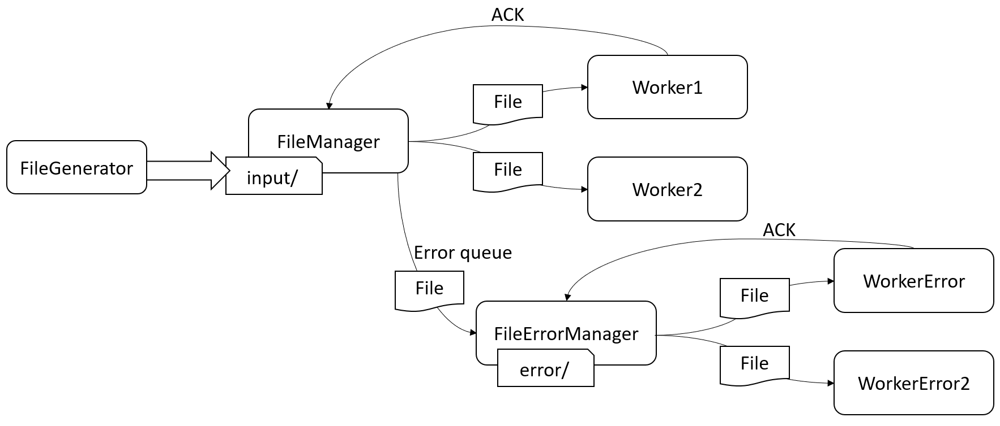

# TP-Archi
Ce TP a pour but d'implémenter un système de traitement de fichier "distribué" sur plusieurs workers.

## Auteurs
Marion Motta
Aymeric Larvet
Gwendal Siwiorek

## Lancement

Le projet se décompose en 2 programmes, un générateur fichier qui va générer des fichiers toutes les secondes `` FileGenerator.main()`` , puis un second programme qui va lancer le système de traitement de fichier `` Main.main()`` . Ce deuxième programme s'appuie sur la librairie Vertx qui permet d'utiliser des bus de messages en mémoire, principe  sur lequel nous avons basés notre solution.

Notre solution fonctionne de la manière suivante : un **FileManager** scrute le répertoire input puis dispatch les différents fichiers sur les workers pour traitement. Si le traitement sur le worker tombe en erreur le fichier est alors redirigé vers un une queue de traitement des erreurs pour ne pas encombrer la file principale.

### Schéma

